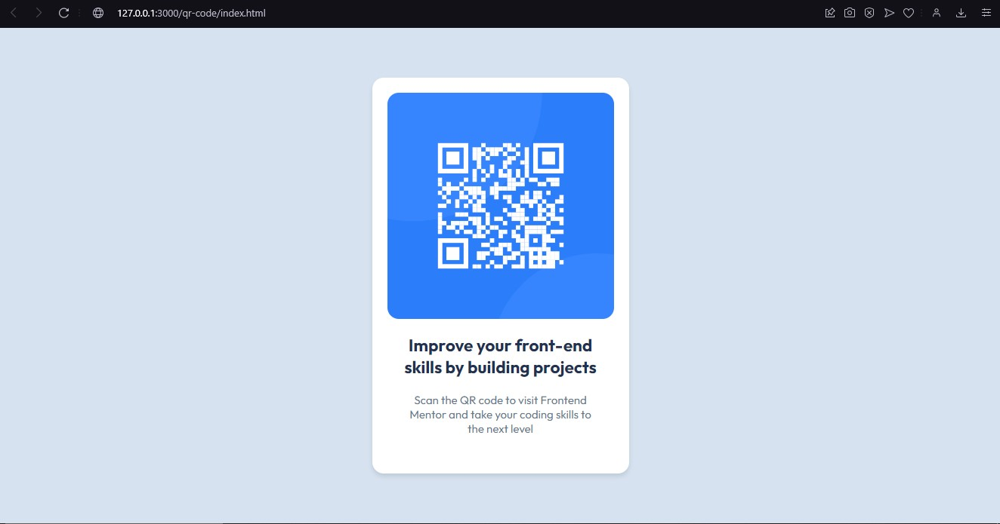
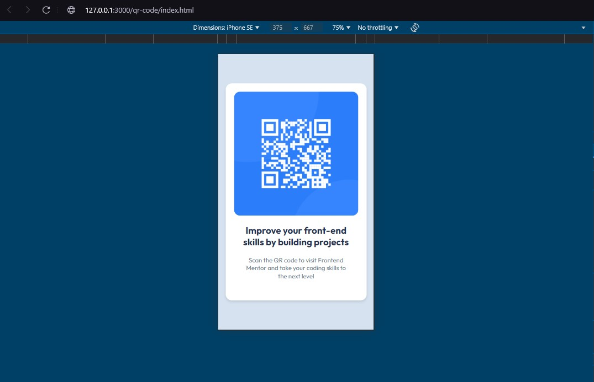

# Frontend Mentor - QR code component solution

This is a solution to the [QR code component challenge on Frontend Mentor](https://www.frontendmentor.io/challenges/qr-code-component-iux_sIO_H). Frontend Mentor challenges help you improve your coding skills by building realistic projects. 

## Table of contents

- [Overview](#overview)
  - [Screenshot](#screenshot)
  - [Links](#links)
- [My process](#my-process)
  - [Built with](#built-with)
  - [What I learned](#what-i-learned)
  - [Continued development](#continued-development)
  - [Useful resources](#useful-resources)
- [Author](#author)
- [Acknowledgments](#acknowledgments)

## Overview

### Screenshot

Here are the screenshots for the final solution. For the mobile design, I simply used the responsiveness tool from the web browser DevTools.




### Links

- Solution URL: [Add solution URL here](https://your-solution-url.com)
- Live Site URL: [Add live site URL here](https://your-live-site-url.com)

## My process

### Built with

For this first challenge, I decided to only use native HTML5 and CSS3, to focus solely on what I struggle the most, that is, 
semantic HTML and CSS organization.

- Semantic HTML5 markup
- CSS custom properties
- Flexbox
- CSS Grid
- ARIA - Accessibility Rich Internet Applications
- BEM - Block Element Modifier naming convention for CSS
- CDN - Content Delivery Network used for importing the Outfit Google Font
- GitHub Pages for hosting

### What I learned

- The main tag
- Remove unnacessary divs
- How to import fonts with CDN
- Reset CSS to have more control over my styles
```css
*,
*::before,
*::after {
    margin: 0;
    padding: 0;
    box-sizing: border-box;
}
```
- How to use hsl and how it differs from rgba
- How align-content and align-items are different from each other

### Continued development

The main points I still need to develop are:
- Base styles: I struggle a lot on defining the base styles for the pages, that includes:
    - font-family
    - font-size
    - colors
    - themes
    - variables
- Controlling layouts: I have a hard time making the best decisions about padding and margins.
- Working with images: I still haven't really understood when to define images width and height properties.
- Gain more knowledge about ARIA.

### Useful resources

https://fonts.google.com/selection#how-to-use
https://fonts.google.com/knowledge/using_type/the_foundations_of_web_typography
https://fonts.google.com/knowledge/using_type/choosing_a_suitable_line_height


- [Example resource 1](https://www.example.com) - This helped me for XYZ reason. I really liked this pattern and will use it going forward.
- [Example resource 2](https://www.example.com) - This is an amazing article which helped me finally understand XYZ. I'd recommend it to anyone still learning this concept.

**Note: Delete this note and replace the list above with resources that helped you during the challenge. These could come in handy for anyone viewing your solution or for yourself when you look back on this project in the future.**

## Author

- Website - [Add your name here](https://www.your-site.com)
- Frontend Mentor - [@yourusername](https://www.frontendmentor.io/profile/yourusername)
- Twitter - [@yourusername](https://www.twitter.com/yourusername)

**Note: Delete this note and add/remove/edit lines above based on what links you'd like to share.**

## Acknowledgments

This is where you can give a hat tip to anyone who helped you out on this project. Perhaps you worked in a team or got some inspiration from someone else's solution. This is the perfect place to give them some credit.

**Note: Delete this note and edit this section's content as necessary. If you completed this challenge by yourself, feel free to delete this section entirely.**
