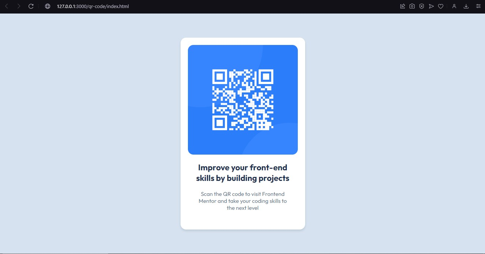
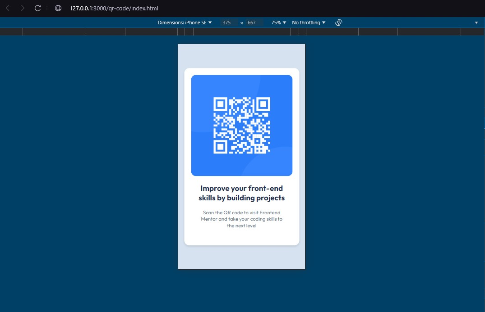

# Frontend Mentor - QR code component solution

This is a solution to the [QR code component challenge on Frontend Mentor](https://www.frontendmentor.io/challenges/qr-code-component-iux_sIO_H). Frontend Mentor challenges help you improve your coding skills by building realistic projects.

## Table of contents

- [Overview](#overview)
  - [Screenshot](#screenshot)
  - [Links](#links)
- [My process](#my-process)
  - [Built with](#built-with)
  - [What I learned](#what-i-learned)
  - [Continued development](#continued-development)
  - [Useful resources](#useful-resources)
- [Author](#author)
- [Acknowledgments](#acknowledgments)

## Overview

### Screenshot

Here are the screenshots for the final solution. For the mobile design, I simply used the responsiveness tool from the web browser DevTools.




### Links

- Solution URL: [View code](https://github.com/medina325/qr-code-frontend-challenges)
- Live Site URL: [Live site](https://medina325.github.io/qr-code-frontend-challenges/)

## My process

### Built with

For this first challenge, I decided to only use native HTML5 and CSS3, to focus solely on what I struggle the most, that is, 
semantic HTML and CSS organization.

- Semantic HTML5 markup
- Flexbox
- ARIA - Accessibility Rich Internet Applications
- BEM - Block Element Modifier naming convention for CSS
- CDN - Content Delivery Network used for importing the Outfit Google Font
- GitHub Pages for hosting

### What I learned

- Importance of taking accessibility into consideration:
    - usage of ARIA tools
    - importance of header hierarchy (click [here](https://dequeuniversity.com/rules/axe/4.6/page-has-heading-one?application=axeAPI) for more)
- Semantic tags such as main, p, footer
- Not nesting interactive elements, e.g.:
```css
<button>
    <a href="...">...</a>
</button>
```
- Different ways of importing fonts
    - using a `link` tag or a `import` statement inside my CSS
- Reset CSS to have more control over the layout:
```css
* {
    margin: 0;
    padding: 0;
    box-sizing: border-box;
}
```
- How to use hsl and how it differs from rgba
- How align-content and align-items differ from one another

### Continued development

The main points I still need to develop are:
- Base styles: I struggle a lot on defining the base styles for the pages, that includes:
    - font-family
    - font-size
    - colors
    - themes
    - variables
- Controlling layouts: I have a hard time making the best decisions about padding and margins.
- Working with images: I still haven't really understood when to define images width and height properties.
- Gain more knowledge about ARIA.

### Useful resources

- [Kevin Powell video on Flexbox](https://www.youtube.com/watch?v=u044iM9xsWU&pp=ygUHZmxleGJveA%3D%3D) - great video explaining everything you need to know about Flexbox in only 30 mins.
- [ARIA page on mdn web docs](https://developer.mozilla.org/en-US/docs/Web/Accessibility/ARIA) - Helpful but it can feel a little overwhelming, so I recommend the video below.
- [Video on ARIA](https://www.example.com) - Really interesting presentation by Accessibility Engineer Léonie Watson.
- [Learn more about fonts AKA typography](https://fonts.google.com/knowledge/using_type/the_foundations_of_web_typography) - If you know nothing about fonts like me before, then this might help.

## Author

- Website - [Gabriel Medina Braga](https://github.com/medina325) (only my GitHub page for now)
- Frontend Mentor - [@medina325](https://www.frontendmentor.io/profile/medina325)
- Linkedin - [@medina325](https://www.linkedin.com/in/gabriel-medina-braga/)

## Acknowledgments

📣 A shoutout to the creators of this wonderful platform, for sparing me the trouble of defining what frontend challenges to tackle.

As someone who has always struggled with frontend, I now feel hopeful that I can finally bring my frontend skills up to par with my other technical abilities.

